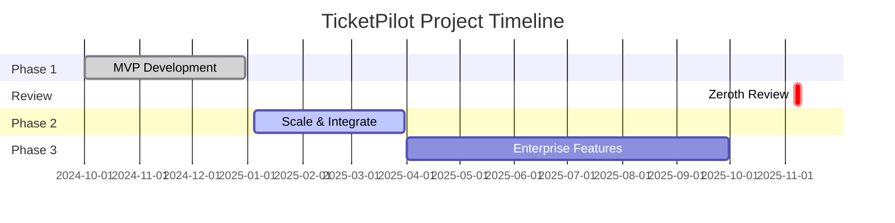

# 📊 Gantt Chart Placeholder

**File:** `gantt_zeroth_review.png`  
**Status:** ⚠️ **REQUIRES MANUAL CREATION**  
**Tool Recommendations:** Microsoft Project, GanttProject, Lucidchart, Mermaid, or Python (matplotlib)

---

## Gantt Chart Specifications

### Timeline
**Review Period:** 6-10 November 2025 (TENTATIVE)  
**Project Duration:** October 2024 - September 2025 (12 months shown)  
**Highlight:** Mark 6-10 Nov as "Zeroth Review Week" in red/orange

---

## Suggested Structure

### Phases to Display

#### Phase 1: MVP (Months 1-3)
**Timeline:** Oct 2024 - Dec 2024  
**Milestones:**
- Week 1-2: Multi-Tenant Foundation
- Week 3-4: Document Ingestion
- Week 5-6: Embedding Pipeline
- Week 7-8: Search & Retrieval
- Week 9-10: Confidence Scoring
- Week 11: Citation & Provenance
- Week 12: Feedback & Analytics

**Status:** ✅ 88.6% Complete

#### Zeroth Review (Week of 6-10 Nov 2025)
**Timeline:** 6-10 Nov 2025  
**Status:** 📅 Pending  
**Highlight:** Use red/orange color to mark this week

#### Phase 2: Scale & Integrate (Months 4-6)
**Timeline:** Jan 2025 - Mar 2025  
**Milestones:**
- Week 13-14: Slack Integration
- Week 15-16: Zendesk Plugin
- Week 17-18: Performance Optimization
- Week 19-20: Advanced Analytics
- Week 21-24: Feedback Enhancements

**Status:** 📅 Planned

#### Phase 3: Enterprise Features (Months 7-12)
**Timeline:** Apr 2025 - Sep 2025  
**Milestones:**
- Month 7-8: Multi-Language Support
- Month 9-10: Security & Compliance (SOC 2)
- Month 11-12: Advanced Features

**Status:** 📅 Planned

---

## Visual Guidelines

### Colors
- **Completed Tasks:** Green (#4CAF50)
- **Current Review:** Red/Orange (#FF5722 or #FFA500)
- **Planned Tasks:** Blue (#2196F3)
- **Dependencies:** Gray dashed lines

### Labels
- Each phase should have a label (e.g., "Phase 1: MVP")
- Milestones should have diamond markers
- Review week should have "TENTATIVE" label

### Size
- **Recommended Dimensions:** 1920x1080 pixels (or 16:9 aspect ratio)
- **File Format:** PNG (preferred) or JPEG
- **File Size:** <2MB

---

## Tools for Creation

### Option 1: Microsoft Project (Professional)
- Import task list from `backlog/product_backlog.csv`
- Set timeline: Oct 2024 - Sep 2025
- Mark 6-10 Nov as milestone
- Export as PNG

### Option 2: GanttProject (Free, Open-Source)
- Download: https://www.ganttproject.biz/
- Create tasks manually from roadmap
- Export as PNG

### Option 3: Lucidchart / Miro (Online)
- Use Gantt chart template
- Customize with TicketPilot phases
- Export as PNG

### Option 4: Python (matplotlib or plotly)
**Sample Code:**
```python
import matplotlib.pyplot as plt
import matplotlib.dates as mdates
from datetime import datetime, timedelta

# Define phases
phases = [
    ("Phase 1: MVP", datetime(2024, 10, 1), datetime(2024, 12, 31)),
    ("Zeroth Review", datetime(2025, 11, 6), datetime(2025, 11, 10)),
    ("Phase 2: Scale", datetime(2025, 1, 5), datetime(2025, 3, 31)),
    ("Phase 3: Enterprise", datetime(2025, 4, 1), datetime(2025, 9, 30)),
]

fig, ax = plt.subplots(figsize=(16, 6))

for i, (label, start, end) in enumerate(phases):
    color = "#4CAF50" if "Phase 1" in label else "#FF5722" if "Review" in label else "#2196F3"
    ax.barh(i, (end - start).days, left=start, height=0.5, color=color, label=label)
    ax.text(start + (end - start) / 2, i, label, ha='center', va='center', color='white', fontweight='bold')

ax.set_xlabel("Timeline (Oct 2024 - Sep 2025)")
ax.set_ylabel("Phases")
ax.set_title("TicketPilot Project Gantt Chart — Zeroth Review Week Highlighted")
ax.xaxis.set_major_formatter(mdates.DateFormatter('%b %Y'))
ax.xaxis.set_major_locator(mdates.MonthLocator())
plt.xticks(rotation=45)
plt.tight_layout()
plt.savefig("gantt_zeroth_review.png", dpi=150)
plt.show()
```

### Option 5: Mermaid (Markdown-based)
**Code:**


**Render using:** https://mermaid.live/ or VS Code Mermaid extension, then export as PNG

---

## Placeholder Image

**If you cannot create a Gantt chart immediately:**  
Create a simple placeholder PNG with text:

```
┌──────────────────────────────────────────────────┐
│                                                  │
│   TicketPilot Project Gantt Chart               │
│                                                  │
│   Phase 1: MVP (Oct-Dec 2024) ████████ ✅       │
│   Zeroth Review (6-10 Nov 2025) ▓▓▓ 📅 TENTATIVE│
│   Phase 2: Scale (Jan-Mar 2025) ░░░░░░          │
│   Phase 3: Enterprise (Apr-Sep 2025) ░░░░░░░    │
│                                                  │
│   [PLACEHOLDER - Create detailed Gantt chart]   │
│                                                  │
└──────────────────────────────────────────────────┘
```

**Create using:** Any image editor (GIMP, Photoshop, Paint.NET) or online tool (Canva)

---

## After Creation

1. Save file as: `TicketPilot_Zeroth_Review/visuals/gantt_zeroth_review.png`
2. Verify file size <2MB
3. Update manifest.json with SHA-256 checksum
4. Include image in PowerPoint presentation (Slide 9)

---

**Last Updated:** 2025-11-09T00:00:00Z  
**Auto-generated by agent**
