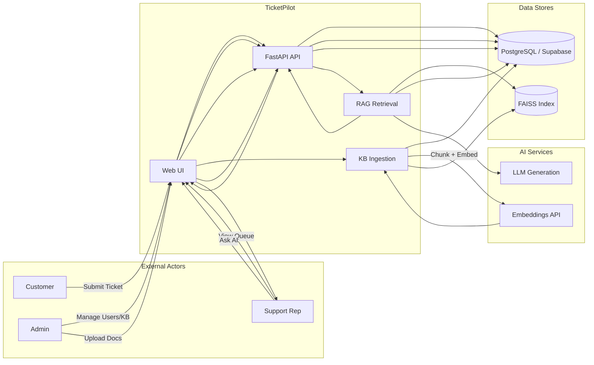
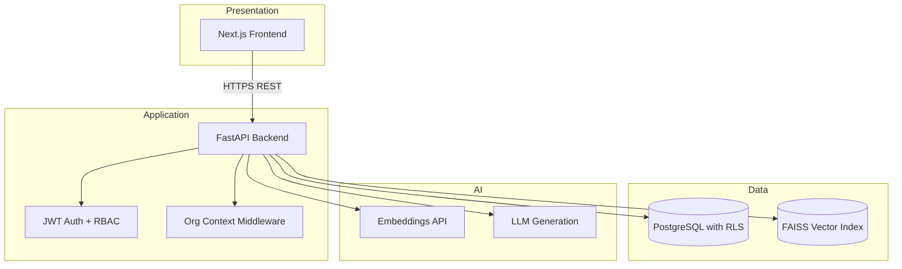
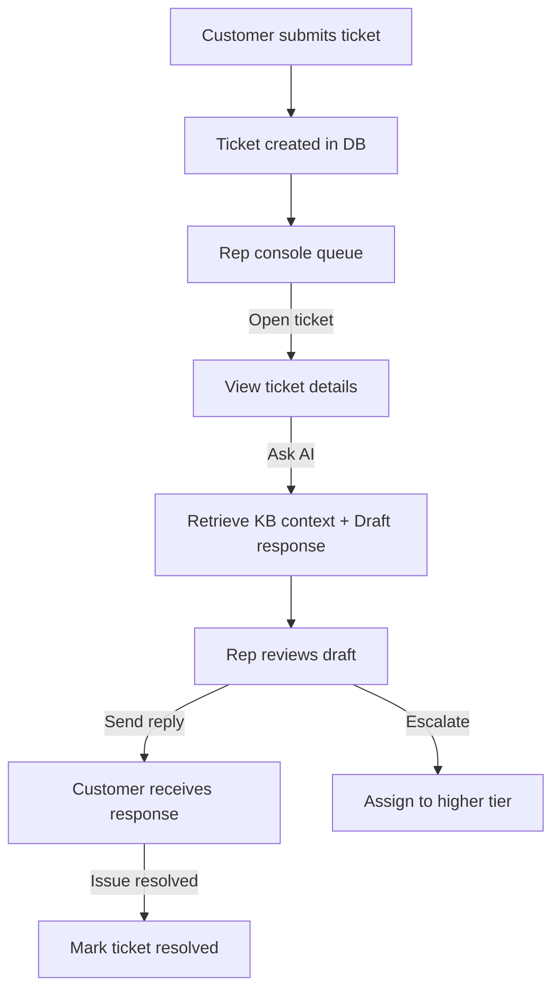
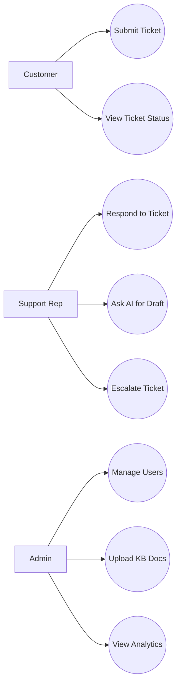
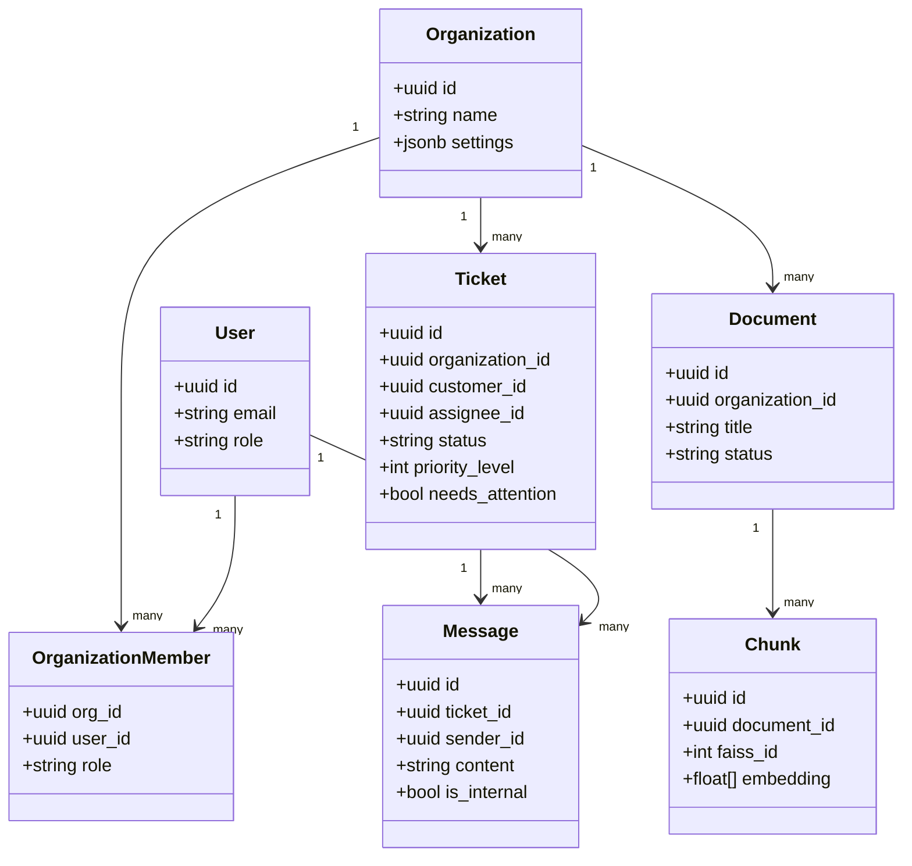
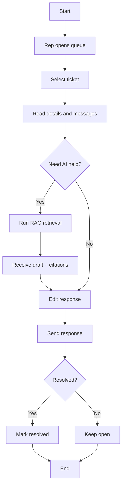
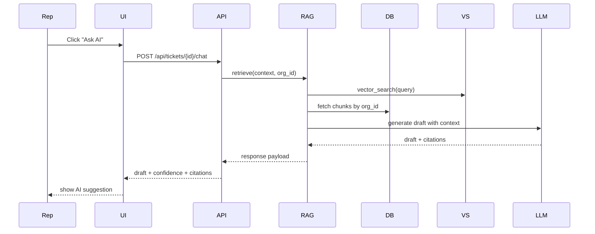
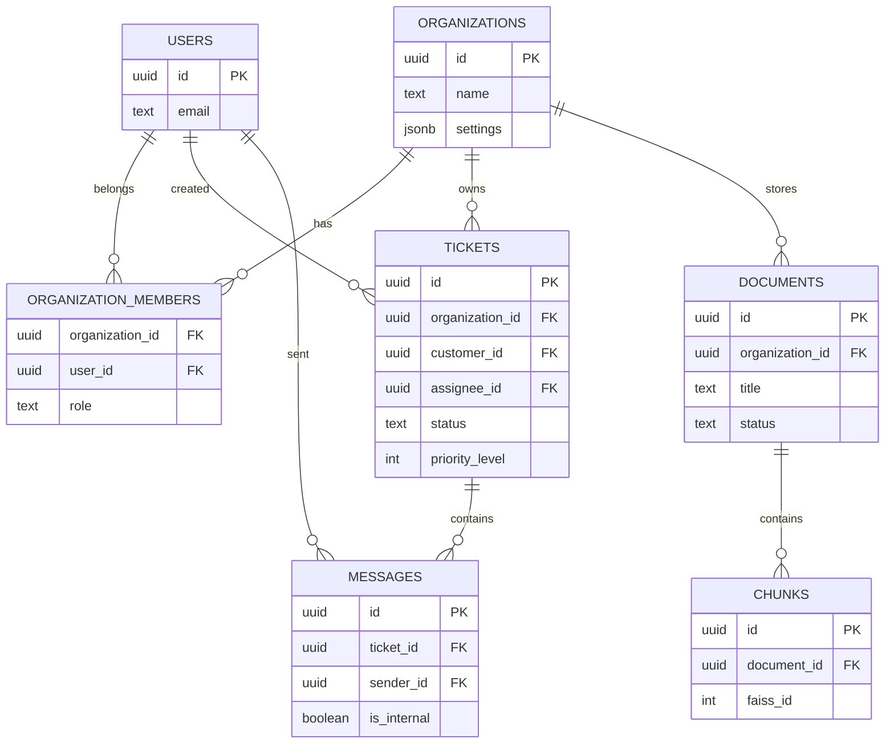

# TicketPilot Project Report - Chapter 4

This document provides the System Design section for TicketPilot. It includes diagram descriptions and Mermaid diagram code for each required diagram.

---

## 4.1 Data Flow Diagram (DFD)

### Description
The DFD shows how data moves between external actors (Customer, Rep, Admin), the TicketPilot application, and supporting services (Supabase, AI services, FAISS). It highlights ticket submission, AI retrieval, and response delivery as primary flows.

### Mermaid (DFD)

---

## 4.2 System Architecture Diagram

### Description
This architecture diagram shows the three-tier structure: presentation (Next.js UI), application (FastAPI services), and data/AI services (PostgreSQL, FAISS, and AI models). It also indicates JWT auth and multi-tenant constraints.

### Mermaid (Architecture)

---

## 4.3 Workflow Diagram

### Description
The workflow diagram illustrates the end-to-end ticket lifecycle: submission, triage, AI assistance, response, escalation, and resolution.

### Mermaid (Workflow)

---

## 4.4 Use Case Diagram

### Description
This diagram shows the main actors and their core use cases. Customers submit and track tickets, reps work the queue and respond with AI assistance, admins manage users and knowledge.

### Mermaid (Use Case)

---

## 4.5 Class Diagram

### Description
The class diagram shows the core domain entities and their relationships. It focuses on organization membership, tickets, messages, and knowledge base entities.

### Mermaid (Class Diagram)

---

## 4.6 Activity Diagram

### Description
The activity diagram shows the detailed steps a rep takes while resolving a ticket with AI assistance.

### Mermaid (Activity)

---

## 4.7 Sequence Diagram

### Description
The sequence diagram captures the request flow when a rep asks the AI for a draft response.

### Mermaid (Sequence)

---

## 4.8 ER Diagram

### Description
The ER diagram shows the relational structure of the database with key entities and relationships. It reflects multi-tenancy and ticket lifecycle support.

### Mermaid (ER)

---

## 4.9 Design Philosophy and Features

### Design Philosophy
TicketPilot is designed to be secure, role-aware, and AI-augmented without removing human oversight. The system follows these guiding principles:
- Security first: data isolation and access control are enforced at every layer.
- Human-in-the-loop AI: AI drafts assist, but reps decide and finalize responses.
- Transparency: citations and confidence scores allow verification.
- Scalability: multi-tenant foundations support growth without redesign.
- Operational clarity: dashboards and analytics provide measurable insight.

### Key Features
- Multi-tenant organization model with row-level security.
- Role-based dashboards and workflows for customers, reps, and admins.
- Ticket lifecycle management with escalation, priority, and ETR.
- Knowledge base ingestion, chunking, and semantic retrieval.
- RAG-based AI response drafting with citations and confidence.
- Admin tools for user management, invites, and settings.
- Analytics for ticket volume, resolution rates, and response times.

---

All diagrams are provided as Mermaid code so they can be rendered directly in Markdown viewers that support Mermaid.
